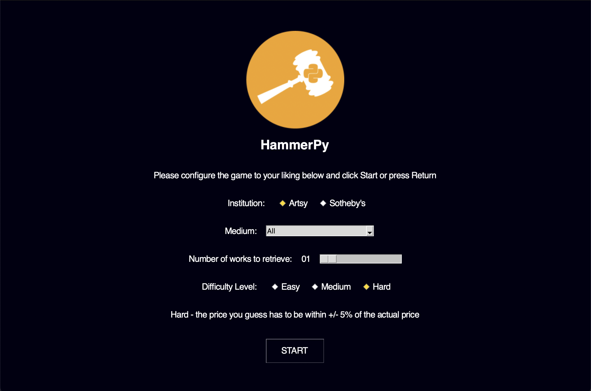

<p align="center">
  
</p>

# HammerPy

HammerPy is a game where users guess the price of artwork available on auction websites. The name comes from the term "hammer price", which refers to the final selling price of a work. Asking prices are used instead for art that is still available for sale.

Currently the game retrieves artwork from [Artsy](https://www.artsy.net) and [Sotheby's](https://www.sothebys.com), and more sources will hopefully be added in the future.

## Setup and Installation

HammerPy requires >= Python 3.8. In order for the Sotheby's integration to work, you need to install a web driver for Chrome, which takes 2 seconds and can be found [here](https://chromedriver.chromium.org/downloads).

Dependencies:
- requests
- urllib3
- Pillow
- beautifulsoup4
- selenium

### Standard Installation

First, consider setting up a virtual environment (`venv`). From the project root:

```bash
mkdir ./env
python3 -m venv ./env
source ./env/bin/activate
python3 -m pip install -r requirements.txt
python3 hammer.py
```

Or you can install the dependencies system-wide (not really recommended) and run the script.

```bash
pip install -r requirements.txt
python3 hammer.py
```

### Docker

Build the image with `./build.sh` and use `./run.sh` to launch the image!

## Quickstart

The game is fairly straightforward because it's open ended - enter the price you think is closest to the worth of the displayed artwork. You cannot go backwards after submitting a guess. Once all guesses have been turned in, the game takes you to the results screen where you can view metadata for the artwork including the real price, what the acceptable range of guesses was, and whether you were correct.

All prices are in USD - any works that have prices in foreign currencies are converted to USD for the game.

There are 3 difficulty levels:
- **Easy**: +/- 25% from actual price
- **Medium**: +/- 15% from actual price
- **Hard**: +/- 5% from actual price

Fetching the art might take a while as the bottleneck here is network speed. If the number of requested works is >= 5, then a `time.sleep` call for 5 seconds is added to avoid spamming the service with requests

HammerPy downloads the images of the art to your computer temporarily for the lifespan of the game. On the results screen, you can decide if you'd like to keep the images for any of the art you like. By default, this is set to `False`, and any artwork you do not explicitly mark as wanting to keep is REMOVED from your system

## Keyboard Navigation

You can traverse the menu without using the mouse! Here are the key bindings:

`q` - Quit. `Control/Command Q` work as well. <br/>
`a` - Selects Artsy as the source <br/>
`s` - Selects Sotheby's as the source <br/>
`ArrowUp/ArrowDown` - Cycles through the Medium / Category <br/>
`ArrowLeft/ArrowRight` - Decrements or increments the number of works to retrieve <br/>
`1` - Sets the difficulty to Easy <br/>
`2` - Sets the difficulty to Medium <br/>
`3` - Sets the difficulty to Hard <br/>
`Return` - Starts game <br/>

You can also hit `Return` to advance through the guessing screens.

## Screenshots




